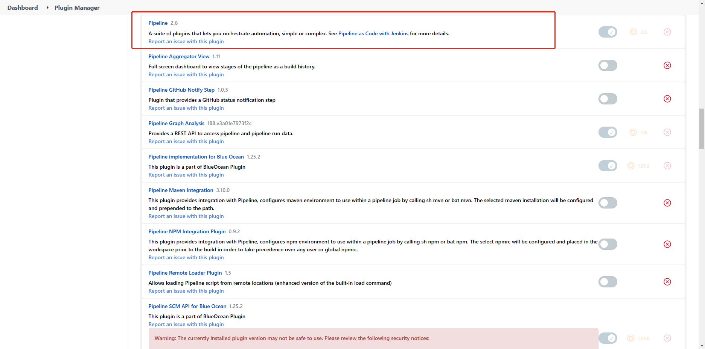
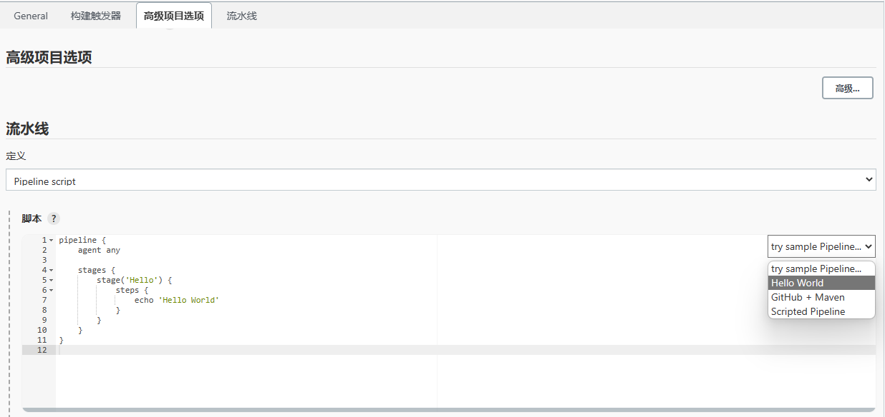

# Jenkins Pipeline 经验积累

Pipeline 和 freestyle project 相比多了很多特性，以下列出主要的几点：

1. 代码化：参数、选项、节点及节点上的工作空间、以及最核心的的执行步骤全部代码化，适合被版本控制工具管理，更加地 DevOps
2. 分阶段：一个流水线运行起来后，由多个阶段（Stage）构成，阶段内又有多个步骤，而 freestyle project
   相当于只是单阶段多步骤，以下是有阶段概念之后能实现什么功能：
   1. 一条流水线运行失败后，可以从指定阶段重新继续跑流水线
   2. 步骤是顺序的，而阶段是可以并行的，所以支持了多阶段并行执行
   3. 阶段可以多重嵌套，也就是多个阶段外层也可以套一层阶段，这个说是一个大阶段，那这个大阶段又可以和另一个大阶段并行执行
   4. 每个阶段有自己的花费时间，有自己的阶段成功失败状态，结合可视化插件，就能更加直观地定位每一次发布过程中的问题

## 安装

搜索 pipeline 即可找到官方插件，增加 pipeline 功能，其他一大堆依赖的插件会自动安装



创建一个流水线 job 后，只需要写流水线脚本，就可以定义阶段，阶段内定义步骤，如图，官方 Hello World 例子，定义了一个阶段，定义了一个步骤



## 流水线模板（持续更新补充）
```groovy
pipeline {
	////////////////////////////////////////////////////////////////////////////////
	// 指定运行节点
	////////////////////////////////////////////////////////////////////////////////
    agent any // 任意节点都可以运行流水线


    // agent {
    //    node {
    //        label '192.168.10.10' // 指定含有特定标签的节点
    //        customWorkspace "${NFSPATH2}/jobs/${JOB_NAME}/${branch}/"  // 该节点本次 pipeline 的工作目录
    //    }
    // }


    // agent node // 整个流水线不定义 agent 然后在每个阶段里面再定义不同的 agent


	////////////////////////////////////////////////////////////////////////////////
	// 指定整个流水线每个阶段都有的环境变量
	////////////////////////////////////////////////////////////////////////////////
    environment {
        PATH = "/usr/local/bin:$PATH"
    }


	////////////////////////////////////////////////////////////////////////////////
	// 构建选项
	////////////////////////////////////////////////////////////////////////////////
    options {
        timeout(time: 1, unit: 'HOURS')		// 流水线整体超时时间，单位还有 MINUTES SECONDS
        // ansiColor('xterm')				// 需要安装 ansiColor 插件支持
        timestamps()						// 控制台输出日志增加时间戳 需要安装 Timestamper 插件
        buildDiscarder(						// 自动删除旧的构建记录
            logRotator(						// 系统自带默认策略 
				artifactDaysToKeepStr: '',	// 发布包保留最大天数
				artifactNumToKeepStr: '',	// 发布包保留最大个数
				daysToKeepStr: '', 			// 构建保留的天数
				numToKeepStr: '30')			// 构建暴露的最大个数
        )
        disableConcurrentBuilds()			// 不允许并发构建
        // retry(3)							// 整条流水线的重试次数
    }


	////////////////////////////////////////////////////////////////////////////////
	// 定义构建参数
	////////////////////////////////////////////////////////////////////////////////
    parameters {
        booleanParam(name: 'BUILD', defaultValue: true, description: '编译打包')
        booleanParam(name: 'DEPLOY', defaultValue: true, description: '部署')
        choice(name: 'BRANCH', choices: ['devS', 'devSX', 'mainXW'], description: 'Git 项目代码分支，仅重启忽略此参数')
        booleanParam(name: 'AUTO_ROLLBACK', defaultValue: true, description: '允许内部健康检查失败时自动回退')
        booleanParam(name: 'ENABLE_DOMAIN_NAME_HEALTH_CHECK', defaultValue: true, description: '启用域名健康检查')
        string(name: 'GIT_REPO_PATH', defaultValue: '/path/to/repo', description: 'git 项目 fetch 下来的目录')
    }


	////////////////////////////////////////////////////////////////////////////////
	// 定义阶段
	////////////////////////////////////////////////////////////////////////////////
    stages {
        stage('初始化/调试输出') {
            steps {
                wrap([$class: 'BuildUser']) { // 调用这个插件后会在环境变量中得到 BUILD_USER 需要安装 build user vars 插件
                    // buildDescription 方法需要安装 Build Name and Description Setter 插件
                    buildDescription('构建分支：' + params.BRANCH + ' 构建人：' + env.BUILD_USER)
                }
                println('输出所有参数： ' + params)
                sh 'bash scripts/check_environment_vars.sh'
            }
        }
        stage('编译打包') {
            when {
                expression { params.BUILD == true }
            }
            steps {
                echo '执行编译打包'
                dir(path: env.GIT_REPO_PATH) {
                    checkout(
                    [
                        $class: 'GitSCM',
                        branches: [[name: params.BRANCH]],
                        // extensions: [[$class: 'RelativeTargetDirectory', relativeTargetDir: env.GIT_REPO_PATH]],
                        userRemoteConfigs: [[credentialsId: 'tokenabc', url: 'ssh://git@gitlab.xxx.com/groupxxx/appxxx.git']]
                    ]
                )
                    sh 'pwd; ls -ltrh'
                }
            }
        }
        stage('传输包至跳板机') {
            when {
                expression { params.DEPLOY == true }
            }
            steps {
                echo '执行传输包至跳板机'
            }
        }
        stage('跳板机上执行脚本') {
            when {
                expression { params.DEPLOY == true }
            }
            steps {
                echo '执行'
            // dir(path: env.JOB_BASE_NAME) {
            //     sh(script: 'bash stop_service.sh')
            // }
            }
        }
        // 包含并行的阶段
        stage('健康检查（3分钟超时）') {
            options {
                timeout(time: 3, unit: 'MINUTES')
            }
            parallel {
                stage('跳板机上健康检查（内部）') {
                    steps {
                        sh """
                        set -e
                        ssh -o StrictHostKeyChecking=no \
                            -i ${SSH_PRIVATE_KEY_PATH} \
                            -p ${jumper_ssh_port} \
                            ${jumper_ssh_user}@${jumper_host} \
                            curl 192.168.1.100:8080//health/status
                        """
                    }
                }
                stage('使用域名健康检查（外部）') {
                    when {
                        expression { params.ENABLE_DOMAIN_NAME_HEALTH_CHECK == true }
                    }
                    steps {
                        sh 'python3 main.py health-check https://app.xxx.com/health/status'
                    }
                }
            }
        }
        stage('内部健康检查(3分钟超时)') {
            steps {
                echo '执行'
                // script 内使用 try catch 可以把当前 step 标记为红，但整个 stage 仍然是成功标记为绿
                // script {
                //     try {
                //         sh 'exit 0'
                //     }
                //     catch (exc) {
                //         env.internalHealthCheck = 'false'
                //     }
                // }
                // catchError 内的某个步骤出错时，可以控制整个流水线的状态以及当前 stage 的状态，出错的 step 的状态也标记为红
                catchError(buildResult: 'SUCCESS', stageResult: 'FAILURE') {
                    script {
                        env.internalHealthCheck = 'failed'
                        sh 'exit 0' // 这一步失败（非 0 退出）之后，本级 script 块内下面的代码不会执行
                        env.internalHealthCheck = 'success'
                        sh 'echo $internalHealthCheck'
                    }
                }
            }
        }
        stage('域名健康检查') {
            when {
                allOf {
                    expression { params.DEPLOY == true }
                    expression { params.ENABLE_DOMAIN_NAME_HEALTH_CHECK == true }
                    environment name: 'internalHealthCheck', value: 'success'
                }
            }
            steps {
                echo '执行健康检测'
            }
        }
        stage('回退') {
            when {
                allOf {
                    expression { params.DEPLOY == true }
                    expression { params.AUTO_ROLLBACK == true }
                    environment name: 'internalHealthCheck', value: 'failed'
                }
            }
            steps {
                echo '开始回退'
            }
        }
    }


    ////////////////////////////////////////////////////////////////////////////////
    // 所有阶段完成后的应该执行的步骤
    ////////////////////////////////////////////////////////////////////////////////
	post {
        success {
            echo '流水线成功'
        }
        failure {
            echo '流水线失败'
        }
        aborted {
            echo '流水线被中止'
        }
        always {
            echo '流水线结束'
            // cleanWs()  // 清理工作空间里的文件，需要安装 Workspace Cleanup 插件
        }
    }
}
```
