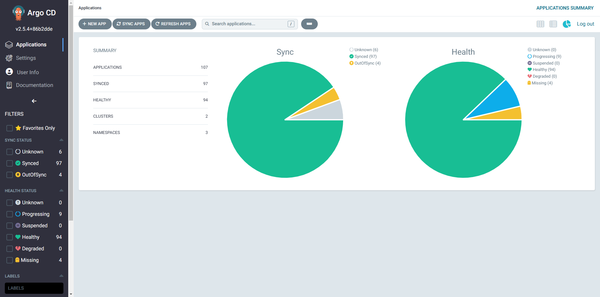
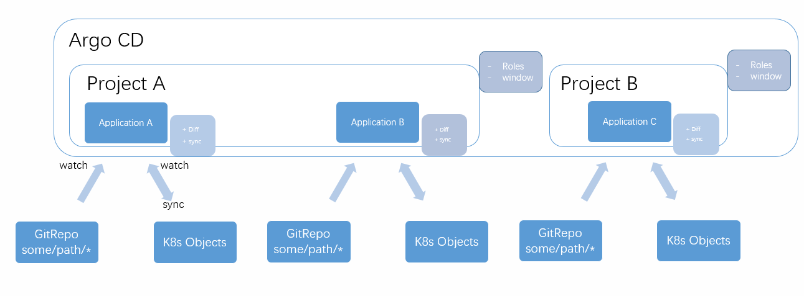

# Argo CD 搭建使用入门

Argo CD 已然成为 K8s 持续部署的最佳实践。快速使用起来吧！

<!-- more -->

## 简介

Argo CD 是面向 Kubernetes 基于声明式配置的、GitOps 的 持续交付工具。



Argo CD 里的核心对象设计

- Repo: 代码仓库，Git Repo 是其中一种。根据指定的项目某个目录路径，获取目录下 K8s 对象的声明式描述文件 (.yaml)
- K8s Objects: 包括 Deployment, Service, configMap 所有 K8s 对象，获取 K8s 集群上当前已存在的对象
- Application: 应用，Repo 和 K8s Objects 是该对象的必需属性，被创建出来即刻 watch 这两个对象
    - 实时执行 Diff 方法， 如果一致返回 Synced，只要不一致返回 Out of Sync
    - 可手动或自动执行 sync 方法，将 Repo 描述的对象同步至 K8s 对象
- Project: Application 不能独立存在，必须归属于一个 Project，而 Project 主要的两个属性：
    - Roles， 实现 Argo CD 内不同用户的行为权限控制
    - window， 实现预先配置的定时执行 sync 的功能



## 安装

[官网指导](https://argo-cd.readthedocs.io/en/stable/getting_started/)

创建命名空间和资源

```shell
kubectl create namespace argocd
kubectl apply -n argocd \
	-f https://raw.githubusercontent.com/argoproj/argo-cd/stable/manifests/install.yaml
```

获取 admin 初始化密码

```shell
kubectl -n argocd \
	get secret argocd-initial-admin-secret \
	-o jsonpath="{.data.password}" | base64 -d; echo
```

## TLS 配置

[官网指导](https://argo-cd.readthedocs.io/en/stable/operator-manual/tls/#tls-certificates-used-by-argocd-server)

```bash
kubectl create -n argocd secret tls argocd-server-tls \
  --cert=/path/to/cert.pem \
  --key=/path/to/key.pem
```

# 反向代理

[官网指导](https://argo-cd.readthedocs.io/en/stable/operator-manual/ingress/#argocd-server-and-ui-root-path-v153)

```bash
kubectl -n argocd edit cm argocd-cmd-params-cm
```

```yaml
apiVersion: v1
data:
  server.basehref: /argo-cd
  server.rootpath: /argo-cd
kind: ConfigMap
metadata:
  ...
```

# 本地用户

[官网指导](https://argo-cd.readthedocs.io/en/stable/operator-manual/user-management/#overview)

```yaml
apiVersion: v1
kind: ConfigMap
metadata:
  name: argocd-cm
  namespace: argocd
  labels:
    app.kubernetes.io/name: argocd-cm
    app.kubernetes.io/part-of: argocd
data:
  # add an additional local user with apiKey and login capabilities
  #   apiKey - allows generating API keys
  #   login - allows to login using UI
  accounts.alice: apiKey, login
  # disables user. User is enabled by default
  accounts.alice.enabled: "false"
```

## SSO

[官网指导](https://argo-cd.readthedocs.io/en/stable/operator-manual/user-management/#sso)

### GitLab

[网友配置示例](https://blog.csdn.net/weixin_45133467/article/details/127587190)

[dexidp官方文档参阅](https://dexidp.io/docs/connectors/gitlab/)

修改argocd配置

```bash
kubectl -n argo-cd edit cm argocd-cm
```

```yaml
apiVersion: v1
data:
  dex.config: |
    # cmread gitlab
    connectors:
    - type: gitlab
      id: gitlab
      name: GitLab
      config:
        clientID: 
        clientSecret:
        baseURL: https://gitlab.xxx.com:2443/
        redirectURI: k8s-ops.xxx.com:28443/argo-cd/api/dex/callback
        # groups: # 限制能登录的 gitlab 用户组
        # - ops
  url: https://k8s-ops.xxx.com:28443/argo-cd
kind: ConfigMap
metadata:
  ...
```

支持热更新，edit 修改完之后自动生效

## RBAC

[https://argo-cd.readthedocs.io/en/stable/operator-manual/rbac/](https://argo-cd.readthedocs.io/en/stable/operator-manual/rbac/)

[https://www.modb.pro/db/117828](https://www.modb.pro/db/117828)

Argo CD 内置角色

+ role:readonly 只读访问所有资源
+ role:admin 读写所有资源

```bash
kubectl -n argo-cd edit cm argocd-rbac-cm
```

```yaml
apiVersion: v1
kind: ConfigMap
metadata:
  name: argocd-rbac-cm
  namespace: argocd
data:
  policy.default: role:readonly
```

### Argo CD 权限组矩阵

[https://argo-cd.readthedocs.io/en/stable/operator-manual/rbac/#the-action-action](https://argo-cd.readthedocs.io/en/stable/operator-manual/rbac/#the-action-action)

```text
p,<role/user/group>,<resource>,<action>,<object>,< all | deny >

p, role:角色名,       资源类型,      动作,    资源,     允许或拒绝
p, user:用户名,       资源类型,      动作,    资源,     允许或拒绝
p, group:组名,        资源类型,      动作,    资源,     允许或拒绝
```

#### 资源

+ clusters
+ projects
+ applications
+ repositories
+ certificates

#### 动作

+ get
+ create
+ update
+ delete
+ sync
+ override
+ action

全局角色定义示例

```yaml
apiVersion: v1
kind: ConfigMap
metadata:
  name: argocd-rbac-cm
  namespace: argo-cd
data:
  ##############################################
  # 全局（非 Project 级别） 角色权限定义，角色分配
  # 或 全局（非 Project 级别） 用户和组直接分配权限
  ###############################################
  policy.default: role:readonly
  policy.csv: |
    p, role:org-admin, applications, *, */*, allow
    p, role:org-admin, clusters, get, *, allow
    p, role:org-admin, repositories, get, *, allow
    p, role:org-admin, repositories, create, *, allow
    p, role:org-admin, repositories, update, *, allow
    p, role:org-admin, repositories, delete, *, allow

    g, jenkins, role:org-admin

```

给DBA的例子

```yaml
apiVersion: v1
kind: ConfigMap
metadata:
  name: argocd-rbac-cm
  namespace: argo-cd
data:
  policy.default: role:readonly
  policy.csv: |
    p, role:staging-db-admins, applications, create, staging-db-admins/*, allow
    p, role:staging-db-admins, applications, delete, staging-db-admins/*, allow
    p, role:staging-db-admins, applications, get, staging-db-admins/*, allow
    p, role:staging-db-admins, applications, override, staging-db-admins/*, allow
    p, role:staging-db-admins, applications, sync, staging-db-admins/*, allow
    p, role:staging-db-admins, applications, update, staging-db-admins/*, allow
    p, role:staging-db-admins, projects, get, staging-db-admins, allow

    g, db-admins, role:staging-db-admins
```

### project 级别的权限 在 project api （AppProject）里直接定义

```yaml
apiVersion: argoproj.io/v1alpha1
kind: AppProject
metadata:
  name: read-prod
  namespace: ops
spec:
  description: xxxx生产环境应用 角色权限维护人：xx
  destinations:
    - name: "现网 K8s （移动云）"
      namespace: xxx-prod
      server: https://kubernetes.default.svc
    - name: "现网 K8s （阿里云）"
      namespace: xxx-prod
      server: https://xxxxxxxxxxxxxx:443
  roles:
    - name: app-developer
      description: 应用开发
      groups:
        - pdcvg/cps-deal
        - pdcvg/user-sns
        - pdcvg/opf
        - pdcvg/tmt
        - pdcvg/mktg
        - pdcvg/fabric
      policies:
        - p, proj:read-prod:app-developer, applications, action/apps/Deployment/restart, read-prod/*, allow
  sourceRepos:
    - https://gitlab.xxx.com:2443/xxx/xxx/cloud.git
    - https://gitlab.xxx.com:2443/xxx/xxx/k8s_sq.git

```

## web terminal

[https://argo-cd.readthedocs.io/en/stable/operator-manual/web_based_terminal/](https://argo-cd.readthedocs.io/en/stable/operator-manual/web_based_terminal/)

由于安全原因，默认禁用了此功能

nginx代理的话需要支持 websocket 协议升级

```nginx
location = /argo-cd {
  return 301 https://xxx.xxx.com/argo-cd/;
}

location /argo-cd/ {
  proxy_ssl_verify off;
  proxy_set_header Upgrade $http_upgrade;
  proxy_set_header Connection "upgrade";
  proxy_pass https://argocd-server.argocd.svc;
}
```

## 多 k8s 集群配置

[https://blog.csdn.net/weixin_44729138/article/details/122589266](https://blog.csdn.net/weixin_44729138/article/details/122589266)

拿到被添加集群的 kubeconfig

```bash
scp  k8s-node:.kube/config  argocdcli-node:.kube/config.xxx-k8s
```

然后来到 **Argo CD 的管理节点**上执行：

```bash
# 格式
argocd cluster add \
  <kubeconfig内上下文配置名称> \
  --kubeconfig kubeconfig配置文件路径 \
  --name Argo CD 内定义的名字（后续可以去界面上改）

# 示例
argocd cluster add \
	default \
	--kubeconfig ~/.kube/config \
	--name test-env

```

```shell
WARNING: This will create a service account `argocd-manager` on the cluster referenced by context `sandun-nt` with full cluster level privileges. Do you want to continue [y/N]? y
INFO[0016] ServiceAccount "argocd-manager" created in namespace "kube-system" 
INFO[0016] ClusterRole "argocd-manager-role" created  
INFO[0016] ClusterRoleBinding "argocd-manager-role-binding" created 
INFO[0021] Created bearer token secret for ServiceAccount "argocd-manager" 
Cluster 'https://api.nt-k8s.migu:6443' added
```

# gitlab webhook

[https://argo-cd.readthedocs.io/en/stable/operator-manual/webhook/](https://argo-cd.readthedocs.io/en/stable/operator-manual/webhook/)

1. 生成随机密码
2. gitlab 上配置一个新 webhook:
    1. URL: `https://argocd.xxx.com/api/webhook`
    2. Secret 填写刚刚生成的
3. k8s argocd-secret 里配上 gitlab 来的 secret:

**推荐 kubectl edit 修改增加 secret token**

```bash
kubectl edit secret argocd-secret -n argocd
```

```yaml
stringData:
  # github webhook secret
  webhook.github.secret: shhhh! it's a GitHub secret

  # gitlab webhook secret
  webhook.gitlab.secret: shhhh! it's a GitLab secret

  # bitbucket webhook secret
  webhook.bitbucket.uuid: your-bitbucket-uuid

  # bitbucket server webhook secret
  webhook.bitbucketserver.secret: shhhh! it's a Bitbucket server secret

  # gogs server webhook secret
  webhook.gogs.secret: shhhh! it's a gogs server secret
```

## 自定义样式

[官网文档](https://argo-cd.readthedocs.io/en/stable/operator-manual/custom-styles/)

## 便捷外部链接

[官网文档](https://argo-cd.readthedocs.io/en/stable/user-guide/external-url/)

在资源 metadata.annotations 里添加 link.argocd.argoproj.io/external-link

```yaml
apiVersion: apps/v1
kind: Deployment
metadata:
  name: my-svc
  annotations:
    link.argocd.argoproj.io/external-link: http://my-grafana.com/pre-generated-link
```
