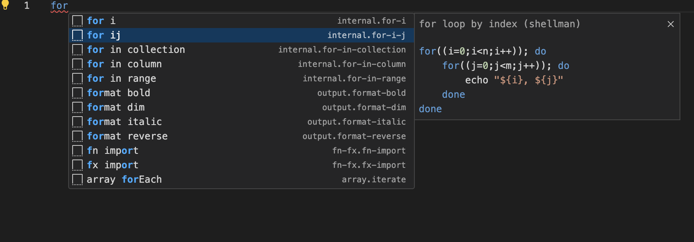
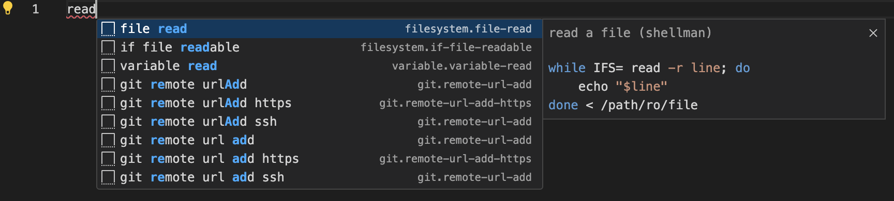
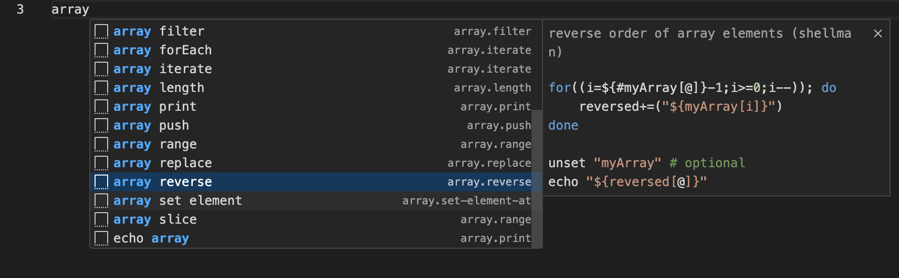
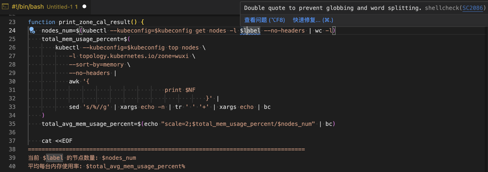
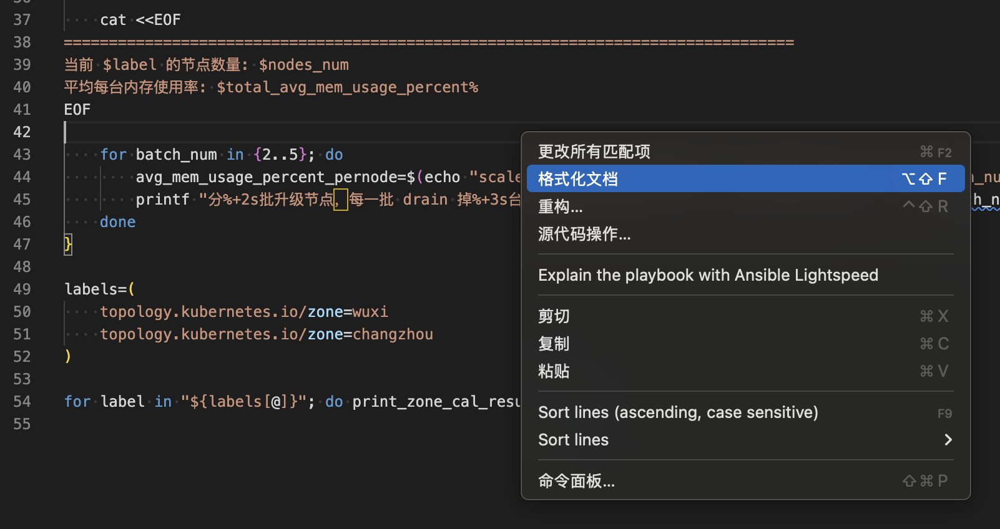

# 推荐 vscode 写 shell 的插件

有了这些插件后写 Shell 是真的香

<!-- more -->

## shellman - 常用代码块补全生成

想写一个for循环，忘了格式，输入 for ，插件会提示各种 for 用法

想写一个读取文件每行文本，然后逐行处理的的时候，输入 read

编写脚本的过程中，要用到数组还能顺便提升相关知识点

## ShellCheck 语法检测，提示错误和警告

把脚本内容粘进编辑器，再也不怕有坑了

## shell-format - 代码格式化

最后写好的脚本，格式化一下，让代码更美观，缩进强迫症的福音

